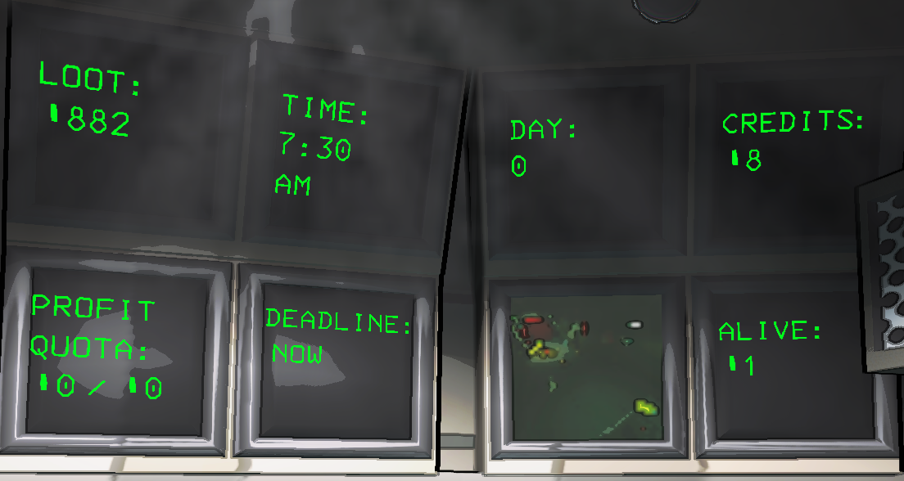
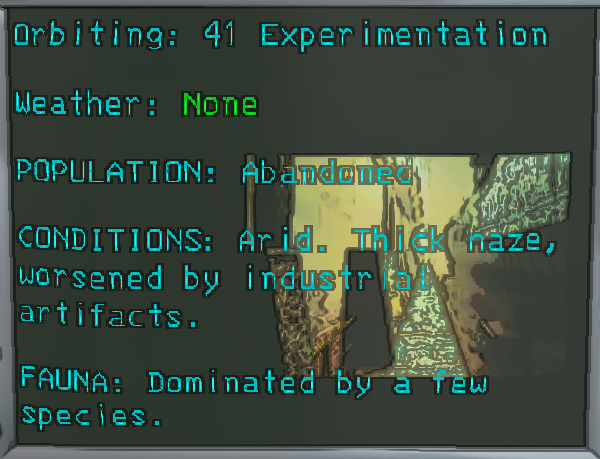
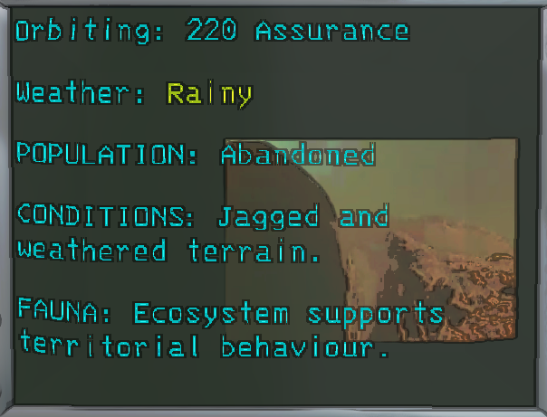
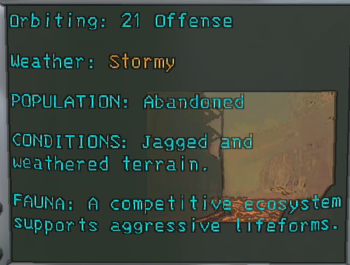
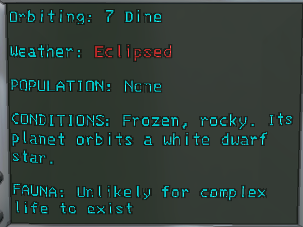

# OpenMonitors

- Inspiration and 95% credit goes
  to [Jamil's CorporateRestructure](https://thunderstore.io/c/lethal-company/p/Jamil/Corporate_Restructure/)

While the `CorporateRestructure` mod gave most of what I wanted:

1. I wanted to add extra configurability, such as where you could place the monitors, and hiding them.
2. I also wanted to add a `Life Support` monitor, which shows the number of players still alive.
3. Fix a first-time loading bug that happens with the `Credits` monitor.

- On hosting a game for the first time that session, the `Credits` monitor throws an NPE since the `TextMeshProGUI`
  object hasn't completely loaded into the game yet. Exiting the lobby, and then re-hosting fixes it, but still
  annoying.
    - I _could_ have made a `Prefix` patch for that one specific method, but to me that's a band-aid fix, and patching
      patches is a _really_ bad practice IMO.

## New Monitors [Client]

_Each monitor may be hidden from view via configuration setting._

- Ship Loot
- Time of Day
- Credits
- Total Days (Clients display `?` until the first day is completed)
- Life Support (Number of players still alive)

## Navigation Monitor [Client]

_Weather can be hidden from `Terminal` and `Navigation` monitor via configuration setting._

Weather condition is colored based on the condition:

- None / Unknown = Green
- Dust Clouds = Green
- Rainy = Yellow
- Foggy = Yellow
- Stormy = Orange
- Flooded = Orange
- Eclipsed = Red

## Monitor Layout

`1`: PROFIT QUOTA

`2`: DEADLINE

`3`: CAMERA INSIDE SHIP

- This slot is not a possible choice for the new monitors, because it's the camera inside the ship, which I'd rather 
not touch for now.
- If you set a monitor to use slot 3, that monitor will revert back to it's default slot position.

`4`: LIFE SUPPORT

`5`: LOOT

`6`: TIME

`7`: DAY

`8`: CREDITS

| 5 | 6 | 7     | 8 |
|---|---|-------|---|
| 1 | 2 | ~~3~~ | 4 |
